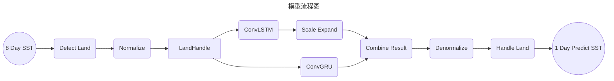

# SST Models

海洋表面温度（SST）预测模型

## 目录结构

```
.
├── app					# 源代码
│   ├── config.py			# APP运行的相关配置
│   ├── core				# 核心模块，负责上下文管理
│   ├── data				# 数据模块。可用于数据加载和写入
│   ├── jobs.py				# App的工作流，其中定义了模型整体的运行流程
│   ├── logs				# 日志框架
│   ├── main.py				# 程序入口
│   ├── models				# 模型模块，负责模型加载和执行
│   └── workflow			# 流式工作框架
├── README.md			# 使用手册
├── requirements.txt	# 依赖条件
├── resources			# 依赖的资源目录
│   ├── application.yaml	# 项目的相关配置文件
│   ├── data				# 数据处理相关配置文件
│   └── models				# 模型权重及其配置
│       ├── convlstm			# 残差预测模型权重以及相关参数
│       └── season				# 季节预测模型权重
└── tests				# 单元测试

```

## 模型运行



解释：

- Detect Land： 提取出陆地部分的数据
- LandHanle：将陆地数据赋值为0
- Normalize： 数据归一化
- ConvLSTM：残差预测
- Scale Expand：数量级对齐
- ConvGRU：季节变化下的SST预测
- Combine Result：模型预测结合
- Denormalize：反归一化
- Handle Land：陆地部分数据的归位

## 使用说明

在`app/main.py`中包含了一个使用样例，可以直接运行。接下来展开具体说明

> [!Tip]
>
> 如果你已经有一个空间尺度为 $720 \times 1440$ 的**SST**数据，你可以将其放入根目录下的`data`
> 文件夹下，并将其命名为`sst.day.mean.2020.nc`。或者更改`main.py`中的`nc_file_path`变量。
>
> 如果你没有此类文件，`main.py`为了保证演示效果，会为你自动下载一个来自**NOAA**的2020年的**SST**
> 均值数据，默认保存在`data/sst.day.mean.2020.nc`。

```python
from data.repository import NetCDFRepository
from jobs import models_predict


# 检查文件和默认下载
def check_file(file_path):
    import os
    if os.path.exists(file_path):
        return True
    else:
        url = 'https://psl.noaa.gov/thredds/fileServer/Datasets/noaa.oisst.v2.highres/sst.day.mean.2020.nc'
        print(f'file not found at [{file_path}]')
        print(f'we are going to download an example file from NOAA with [{url}] and save it to [{file_path}]')
        user_choose = input('do you want to download an example from NOAA? (y/n)')
        if user_choose in ['y', 'Y', 'yes', 'Yes']:
            print(f'Download from [{url}] to [{file_path}]')
            os.system(
                f'curl {url} -o {file_path}')
            return os.path.exists(file_path)
        else:
            return False


# 文件路径
nc_file_path = '../data/sst.day.mean.2020.nc'
if not check_file(nc_file_path):
    print('file not found')
    exit(1)
with NetCDFRepository(nc_file_path) as repo:
    sst = repo.get_data('sst')

from config import Idx

# 取出1-8一共8条数据，并设置季节
data = sst[1:9]
data_pack = {
    Idx.data: data,
    Idx.season: 'spring'
}
# 调用模型
res = models_predict(data_pack)

print('finished')

```

