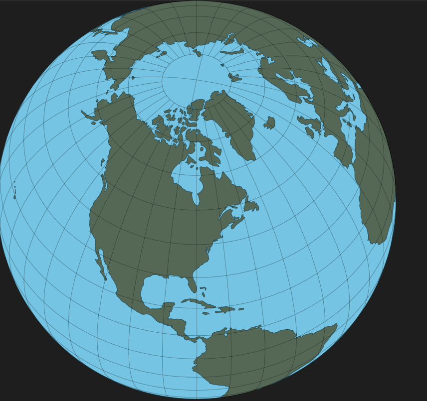

# 技术选型
1. echarts -- 制作二维图表(已淘汰)
2. d3 -- 制作二维图表
3. THREE.js -- 制作三维地球
4. cesiumJS -- 制作三维地球(鉴定为类似百度地图)
5. anime.js -- 动画制作
6. Blender -- 制作三维模型(没学)

# 遇到的问题

## 为什么抛弃echarts？
- 参加的上一个计设中，使用的主要是echarts，不过发现其在数据可视化上还是有一些限制，不如d3；
- 个性化设置太少，也没有提供特别多可参考的样例；

## 使用d3制作复杂的三维地球？
- d3可以通过使用投影，在svg或canvas上绘制简单的三维地球，但无法实现复杂的可视化效果和交互体验；
- d3应该更适合在制作二维图表或者除了正交投影以外的地图上使用，相较于echarts，d3能够实现相对复杂的动画和交互效果；

## 重点在二维还是三维？
- 三维地球的实现难度蛮大的(如果不介意看起来很草率的话)；
- 纯canvas或svg实现还是不如使用Three.js；

## 单独使用svg实现复杂动画？
- 首先不怀疑纯svg能够实现复杂的动画，但是工作量特别大，特别是在制作包含多个标签(rect等)时；
- 在anime.js和GSAP之间，选择了anime，原因是前者有更加丰富的样例展示，以及卓越的star量；
- 不过个性化设计还是次要因素；

## 使用Three还是Cesium？
- Three.js有庞大的社区，更容易学习(但实际还是较难，还没有接触过webGL等图形渲染)；
- Cesium提供的更像是百度地图和高德地图提供的那种API，无法离线使用；
- Cesium基本上是用于有卫星贴图或者需要地面建模的地球模型，考虑到我们的项目可能不需要该功能；

## Blender？
- 目前还没有学，浅浅看了一下，太专业了，没个一两年学不来；
- 尝试用Blender制作了3D地球，如果没系统性的学过，制作不了精良的三维模型；
- 目前能搜到的三维地球项目，不是很老就是使用了自己制作的渲染引擎，我自认为实力不够；

# TODO
- 聚焦二维地图；
- 将热力图和地图轮廓复合，实现简单的拖拽、点击等交互；
- 编写部分UI组件；
- 动画效果尝试；

# 实现自定义瓦片服务
1. 瓦片数据，即一张一张可拼接的png或jpg；
2. 瓦片服务器，可以自建；
3. 配置OpenLayers的瓦片图层；
4. 简单的地图实现就写好了；
